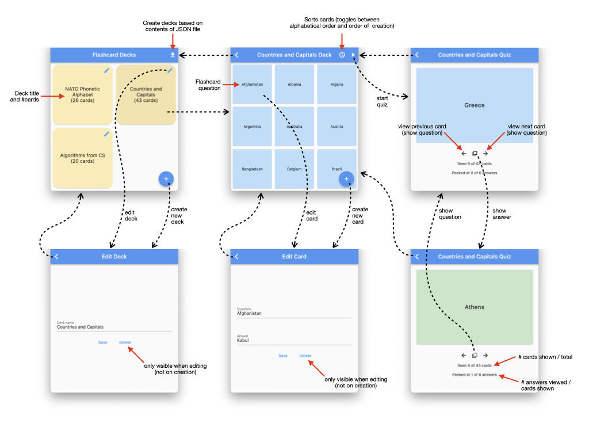

# CS 442 MP3: Flashcards

## 1. Overview

For this machine problem, your task is to implement a multi-page application that allows users to create, edit, and manage decks of two-sided flashcards (with nominal “questions” and “answers” on the two sides), and to run quizzes using cards drawn from a chosen deck.

Deck and flashcard information will be persisted to a local database, and the user interface should be responsive to changes in screen size.

The primary objective of this MP is to provide you with an opportunity to use techniques and APIs related to navigation, responsive design, state management, and persistence presented in class.

## 2. Specifications

You can view a demo of a running application that fulfills the requirements of this MP at <https://youtu.be/v8jJSc1bre0?si=kZuwdqIJJ3mWf6ER>.

Below, we provide a feature overview followed by detailed behavioral specifications and implementation-level requirements that your work should conform to. There are areas where you are free to make design and coding decisions; have fun with these!

### 2.1 Feature overview

Here are the high-level features that the final application should support:

1. Creating, editing, and deleting decks
2. Creating, editing, sorting, and deleting flashcards (associated with a specific deck)
3. Loading a “starter set” of decks and flashcards from the provided JSON file.
4. Persistence of all decks and flashcards across application restarts.
5. Running a “quiz” with all the flashcards in a specific deck

### 2.2 Behavioral specifications

The visual app storyboard below shows how the different pages of the app are connected.

Note that as the screen size increases, you may wish to have your UI respond by merging the deck list and card list pages; you are free to lay out the interface as you wish in this scenario. At smaller screen sizes, however, you should adhere to the described layouts.

#### 2.2.1 Deck list page

The default entry page of the app should display a scrollable list of decks, identified by their titles and listed in the order they were created. The current number of cards in the deck should also be displayed alongside the deck title (this isn't shown in the demo video!). Tapping on a deck should take you to its associated card list. There should be a secondary tap target (e.g., an icon or button) for each deck that should allow you to edit and/or delete it.

There should be a button or menu item for creating a new deck, which should take you to the deck editor screen.

There should also be a button or menu item for inserting decks based on the JSON file found in “assets/flashcards.json”.

#### 2.2.2 Deck editor

The deck editor screen allows the user to change the selected deck’s title. Saving the change persists it to the database. You may also use this screen to allow a deck to be deleted (alternatively, deck deletion can be performed on the deck list page). Note that wherever it is implemented, deleting a deck should also delete all its contained cards from the database.

#### 2.2.3 Card list

The card list page is displayed after selecting a deck, and shows a scrollable view of all the cards in the associated deck, identified by their “question” fields. The card should be sortable alphabetically, and by their order of creation (oldest to newest).

Tapping on a card navigates to the card editor page.

There should be a button or menu item that navigates to the quiz page.

#### 2.2.4 Card editor

The card editor page displays both the selected card’s “question” and “answer” fields, and allows both to be edited and saved. You may also use this screen to allow a card to be deleted (alternatively, deletion may be performed from the card list page).

#### 2.2.5 Quiz

The quiz page allows the user to move through all the flashcards in the currently selected deck, displaying the questions by default, but allowing the user to “peek” at answers for knowledge review.

The flashcards are randomly shuffled upon arriving at the quiz page, and both forward and backward motion through the shuffled cards is possible (though the order of the cards will not change so long as quiz mode is not exited).

At all times, the number of cards viewed out of the total number of cards in the deck should be displayed. Additionally, the number of answers that have been viewed out of the total number viewed should also be displayed.

#### 2.2.6 Responsiveness

Your app should be responsive to changes in screen size. At smaller screen sizes, the deck and flashcard list pages should be displayed separately, as shown in the storyboard above. At larger screen sizes, however, you may choose to display the deck and flashcard list pages together.

The deck list and card list pages themselves should be responsive to changes in screen size, and should display more or less information depending on the available screen real estate. For example, in the demo video above, the number of columns on both list pages increases and decreases as the screen size increases and decreases, respectively.

The quiz page should also be responsive to changes in screen size, and should prioritize the flashcard display over the quiz controls and statistics --- i.e., the flashcard display should grow to occupy a larger fraction of the screen as it grows/shrinks.

### 2.3 Implementation requirements

#### 2.3.1 External packages

We have included the following packages in the `pubspec.yaml` file:

- [`provider`](https://pub.dev/packages/provider): a state management package that you may use to manage the stateful data
- [`collection`](https://pub.dev/packages/collection): provides some helpful data structure related operations
- [`sqflite`](https://pub.dev/packages/sqflite): a database package that you should use to persist your data to a local SQLite database
- [`path_provider`](https://pub.dev/packages/path_provider): provides a platform-agnostic way to access commonly used locations on the filesystem
- [`path`](https://pub.dev/packages/path): provides common operations for manipulating paths

Do not add any additional packages to your `pubspec.yaml` file without first consulting with us.

#### 2.3.2 Database

You should use the [`sqflite`](https://pub.dev/packages/sqflite) package to persist your data to a local SQLite database. You should maintain a separate table for decks and cards, linked by a foreign key. Be sure to use `path_provider` and `path` (as demonstrated in [05_persistence/db_helper.dart](https://github.com/cs442app/demos/blob/main/05_persistence/lib/utils/db_helper.dart)) to correctly place the database file.

#### 2.3.3 Navigation

You should use the `MaterialApp`'s `Navigator` to manage navigation between the different pages of your app, using the `push` and `pop`. At a minimum, your app should contain the five distinct pages show in the storyboard above, though you may choose to display the deck and flashcard list pages together at larger screen sizes (discussed in the next section).

#### 2.3.4 JSON initialization file

In "assets/flashcards.json" you will find a JSON file that contains a set of decks and cards that you should use to initialize your database. You should use the `rootBundle` to load this file, and then use the `json` package to parse the JSON into a Dart object. You should then use the `sqflite` package to insert the decks and cards into your database when the user selects the associated menu item or button on the deck list page.

#### 2.3.5 Code structure and organization

While the specific widget breakdown is up to you, we ask that you modularize your UI code so that it is easy to read and understand. At a minimum, you should define a separate widget for each of the pages described above, though it may make sense to further modularize your code into smaller widgets (e.g., a widget representing a single deck or card).

Your implementation should not make use of any global variables or functions. All data should be encapsulated in your model classes, and you should use some combination of the state management techniques discussed in class.

Major widget classes should live in their own files in the "lib/views" directory. Model classes should live in their own files in the "lib/models" directory. Helper classes should live in their own files in the "lib/utils" directory. You may create additional directories as needed.

#### 2.3.6 Managing asynchronous operations

Your app should not cause the UI to block while performing any asynchronous operations. This includes database operations, which should be performed asynchronously. You may use `FutureProvider`, `FutureBuilder`, or `StreamBuilder` to manage asynchronous operations, and should display a loading indicator while lengthy operations are in progress.

## 3. Testing

We will be testing your application by building and running it as either a native macOS, Android, or iOS app. Your app should run without errors or warnings, and should behave as specified above. Note that because of SQLite and other platform-specific dependencies, you **should not expect your app to run in a web browser or as a native Windows app**.

The minimum screen size we will test on is 320x568 logical pixels (iPhone 5), and the maximum screen size we will test on is 1920x1080 logical pixels (1080p). Your app should be responsive to and display correctly (without overflow errors) on all screen sizes in between.

## 4. Grading

This machine problem is worth 68 points. Your grade will be based on the following criteria:

- 12 points: Decks can be created, edited, and deleted per the specifications above.

- 12 points: Cards can be created, edited, sorted, and deleted per the specifications above.

- 8 points: Quizzes can be run per the specifications above.

- 8 points: Navigation between the different pages of the app works as specified above.

- 4 points: Decks and cards can be loaded from the provided JSON file.

- 16 points: Decks and cards are persisted correctly to a local database.

- 8 points: The UI is responsive to changes in screen size.

If your code does not compile, you will receive a zero for the assignment. If your code compiles but does not meet the requirements, you will receive partial credit based on the extent to which it does.

## 5. Submission

To submit your machine problem, commit and push your code to the "main" branch in your private GitHub repository shared with us. You can make as many commits and pushes as needed; we will assess the most recent version of your code pushed before the deadline.

If you plan to use late submission days, remember to fill out and submit the late day form (found on the course website) before the deadline.
